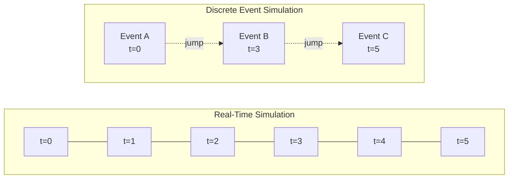
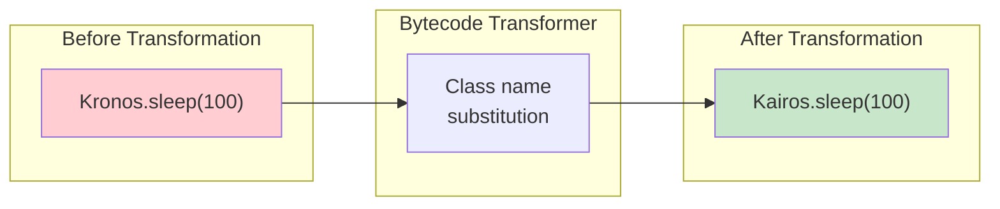
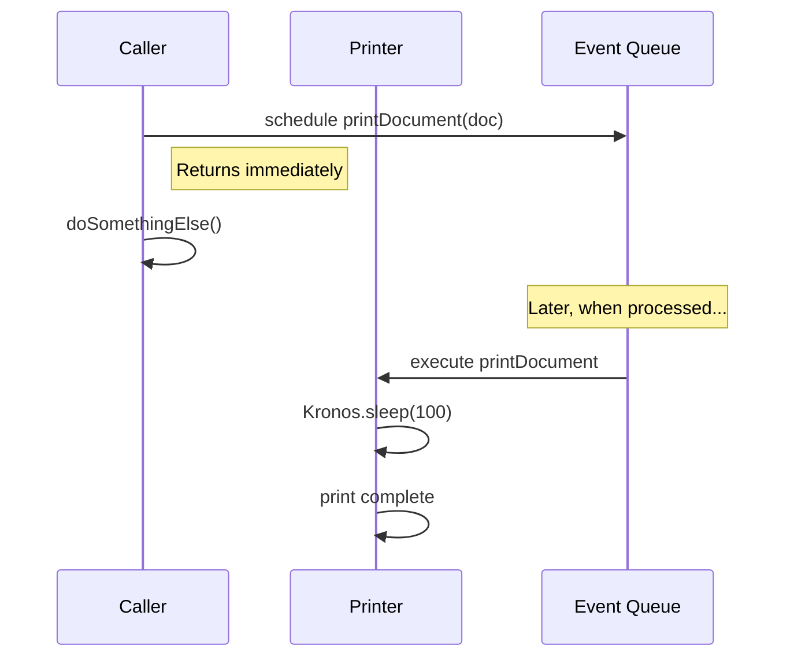
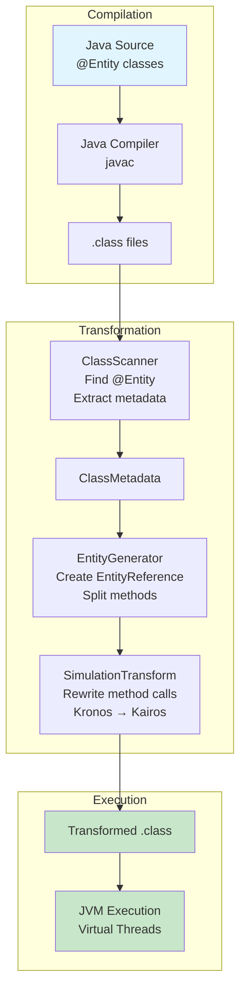
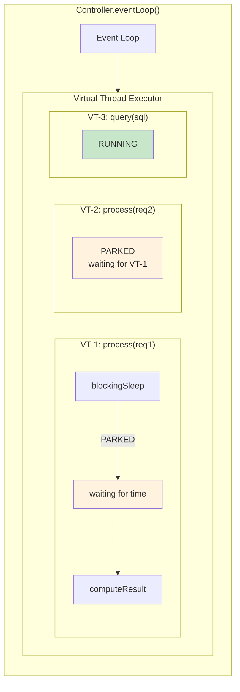
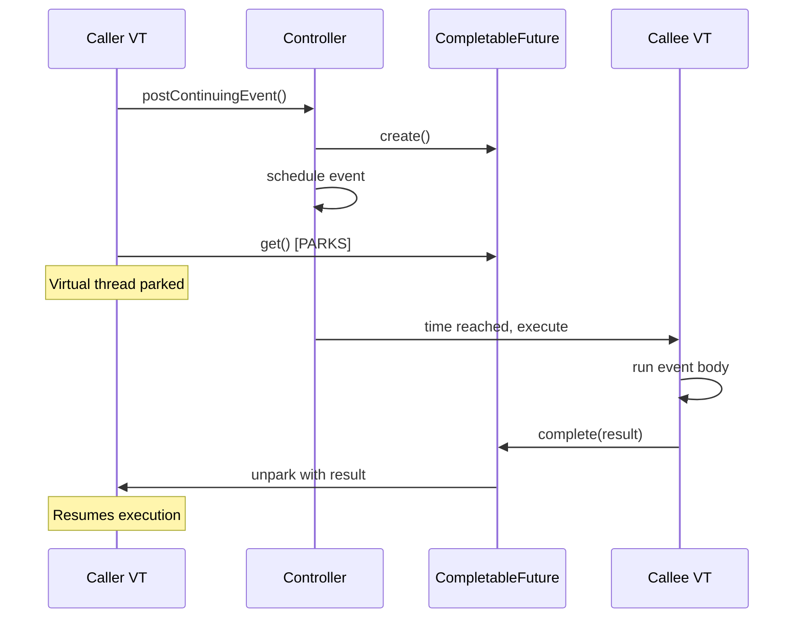
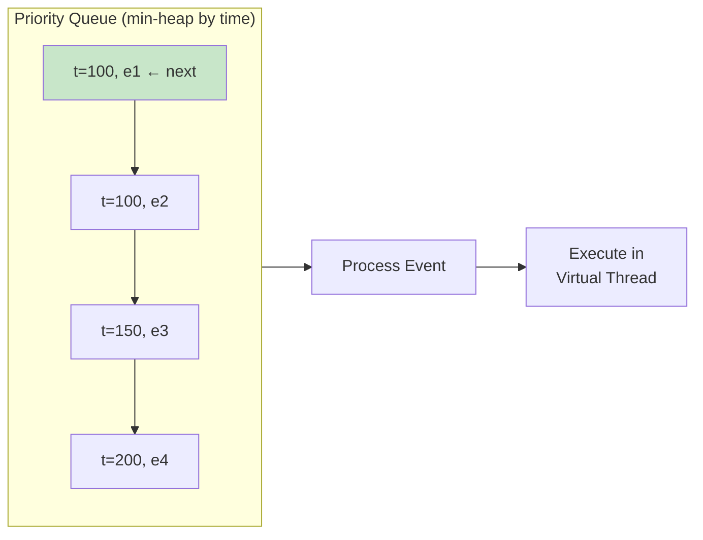

# Prime Mover: Conceptual Deep-Dive

## Table of Contents

1. [Introduction](#introduction)
2. [Discrete Event Simulation Fundamentals](#discrete-event-simulation-fundamentals)
3. [Design Principles](#design-principles)
4. [Kronos and Kairos](#kronos-and-kairos)
5. [Event Semantics](#event-semantics)
6. [The Transformation Model](#the-transformation-model)
7. [Virtual Threads and Continuations](#virtual-threads-and-continuations)
8. [Time Model and Ordering Guarantees](#time-model-and-ordering-guarantees)
9. [Inter-Entity Communication](#inter-entity-communication)
10. [Design Decisions and Trade-offs](#design-decisions-and-trade-offs)
11. [Theoretical Foundations](#theoretical-foundations)

---

## Introduction

Prime Mover enables discrete event simulation using standard Java method calls. Developers write regular Java code; bytecode transformation converts method invocations into scheduled simulation events.

The framework addresses a common problem: traditional DES frameworks require explicit event scheduling, fragmenting natural control flow. Prime Mover eliminates this by treating method calls as implicit events.

**Requirements**: Java 25+ (uses ClassFile API from JEP 484 for bytecode transformation and virtual threads from Project Loom for continuations)

This document covers the technical foundations of the framework.

---

## Discrete Event Simulation Fundamentals

### What is Discrete Event Simulation?

Discrete Event Simulation (DES) is a modeling technique where the state of a system changes only at discrete points in time called **events**. Between events, the system remains unchanged, allowing time to "jump" from one event to the next without simulating every moment in between.



In DES, time advances directly from event to event without simulating the intervals between.

This is fundamentally different from:
- **Continuous simulation**: Where state changes continuously (differential equations)
- **Time-stepped simulation**: Where time advances in fixed increments

### The Event-Driven Paradigm

In traditional DES frameworks, developers explicitly work with events:

```java
// Traditional DES (pseudo-code)
eventQueue.schedule(new CustomerArrivalEvent(time=10, customer=alice));
eventQueue.schedule(new ServiceStartEvent(time=15, customer=alice, teller=bob));

while (!eventQueue.isEmpty()) {
    Event e = eventQueue.poll();
    currentTime = e.time;
    e.execute();  // May schedule more events
}
```

This approach has problems:
1. **Cognitive load**: Developers must constantly think about events
2. **Artificial decomposition**: Natural method sequences become fragmented events
3. **Lost control flow**: The event loop obscures logical program flow
4. **Debugging difficulty**: Stack traces don't show the logical execution path

### Method Calls as Events

Method calls already represent boundaries between state changes. Calling `bank.openAccount()` implicitly creates an event. The framework makes this explicit without requiring changes to the programming model.

```java
// Prime Mover approach
@Entity
public class Bank {
    public void openAccount(String name) {
        System.out.println("Opening: " + name);
        Kronos.sleep(50);  // Time passes
        System.out.println("Opened: " + name);
    }
}

// Usage - looks like regular code
bank.openAccount("Alice");
bank.openAccount("Bob");
```

This code schedules events without the developer thinking about events.

---

## Design Principles

### Transparency

Simulation semantics remain invisible where possible. Code reads as standard Java with time-related operations. The `@Entity` annotation and `Kronos.sleep()` calls are the only visible markers.

### Minimal Intrusion

The framework requires minimal changes to existing code:
- No base classes to extend
- No interfaces to implement
- No callback-style programming
- No manual event scheduling

### Type Safety

All code remains type-safe despite dynamic transformation:
- Compile-time checking for method signatures
- IDE auto-completion functions normally
- Refactoring tools operate correctly

### Determinism

Given identical initial conditions and random seeds, simulations produce identical results. This supports debugging, scientific reproducibility, and validation.

### Scalability

The framework handles millions of entities and billions of events without requiring architectural changes to user code.

---

## Kronos and Kairos

The names derive from Greek concepts of time: Kronos (Χρόνος) represents quantitative, sequential time; Kairos (καιρός) represents qualitative, opportune time. In Prime Mover, these names reflect an architectural separation between the public API and internal implementation.

### Kronos: Public API

`Kronos` is the static API that simulation code calls:

```java
Kronos.sleep(100);        // Wait 100 time units
Kronos.currentTime();     // Query current simulation time
Kronos.setController(c);  // Set the simulation engine
```

Every method in `Kronos` throws `UnsupportedOperationException`. This is intentional:

```java
public class Kronos {
    public static void sleep(long duration) {
        throw new UnsupportedOperationException(
            "Kronos should only be called from transformed code"
        );
    }
}
```

### Kairos: Internal Implementation

`Kairos` provides the actual implementation. Bytecode transformation rewrites every `Kronos` call to `Kairos`:

```java
// Source code:
Kronos.sleep(100);

// After transformation:
Kairos.sleep(100);  // Thread-local controller lookup and event scheduling
```

### Rationale for Separation

1. **Compile-time independence**: Simulation code depends only on `api` module, not `runtime`
   - Smaller deployment artifacts
   - Clean separation of concerns
   - Runtime can evolve independently

2. **Clear API boundary**: `Kronos` defines the interface; `Kairos` provides the implementation

3. **Transformation validation**: Untransformed code calling `Kronos` fails immediately with a clear error

4. **Testing**: Test harnesses can verify transformation occurred

### The Transformation

The bytecode transformer performs a simple but powerful rewrite:



This class name substitution enables the core framework behavior.

---

## Event Semantics

Prime Mover distinguishes two fundamentally different kinds of events based on what the caller expects.

### Non-Blocking Events (Fire-and-Forget)

When you call a method that returns `void` and isn't marked `@Blocking`, the call is **non-blocking**:

```java
@Entity
public class Printer {
    public void printDocument(Document doc) {
        Kronos.sleep(100);  // Printing takes time
        System.out.println("Printed: " + doc.name());
    }
}

// Caller
printer.printDocument(myDoc);  // Returns immediately
printer.printDocument(otherDoc);  // Scheduled after first completes
doSomethingElse();  // Runs while printing is scheduled (but not started)
```

**Semantics**:
- The call returns immediately to the caller
- The actual execution is scheduled as an event
- The caller and the event may execute concurrently at the same simulation time
- Execution order at the same time is defined by scheduling order



### Blocking Events (Request-Response)

Methods returning values, or marked `@Blocking`, block the caller until completion:

```java
@Entity
public class Database {
    @Blocking
    public Record query(String sql) {
        Kronos.blockingSleep(50);  // Query takes time
        return new Record(...);
    }
}

// Caller
Record r = database.query("SELECT * FROM users");  // Caller blocked until result available
processRecord(r);  // Only runs after query completes
```

**Semantics**:
- The call suspends the caller's execution
- Time advances while the callee executes
- When the callee returns, the caller resumes with the return value
- The caller and callee cannot run concurrently

### The Annotation Rules

1. **Methods returning `void`**: Non-blocking by default, can be made blocking with `@Blocking`
2. **Methods returning values**: Always blocking (implicit `@Blocking`)
3. **`@NonEvent`**: Excludes a method from transformation entirely—runs as regular Java

### Causal Consistency

Consider a banking simulation:

```java
@Entity
public class Account {
    private double balance;

    public void deposit(double amount) {
        Kronos.sleep(10);
        balance += amount;
    }

    @Blocking
    public double getBalance() {
        Kronos.sleep(5);
        return balance;
    }
}

// Simulation code
account.deposit(100);
account.deposit(200);
double bal = account.getBalance();  // Returns 300
```

If `getBalance()` were non-blocking, the caller could receive an outdated balance. Blocking semantics ensure causal consistency.

---

## The Transformation Model

### What Gets Transformed

When the transformer processes an `@Entity` class, it performs several modifications:

#### 1. Method Bifurcation

Each event method is split into two:

```java
// Original
public void processOrder(Order o) {
    Kronos.sleep(100);
    // ... processing logic
}

// After transformation (conceptual)
public void processOrder(Order o) {
    // New: Schedule the event
    Controller c = Kairos.getController();
    c.postEvent(this.__entityRef, METHOD_INDEX, o);
}

public void __event_processOrder(Order o) {
    // Original body, with Kronos→Kairos rewrite
    Kairos.sleep(100);
    // ... processing logic
}
```

#### 2. EntityReference Generation

For each entity class, an `EntityReference` implementation is generated:

```java
public interface OrderProcessor$EntityRef extends EntityReference {
    @Override
    Object invoke(int event, Object[] args) {
        return switch (event) {
            case 0 -> target.processOrder((Order) args[0]);
            case 1 -> target.cancelOrder((String) args[0]);
            default -> throw new IllegalArgumentException();
        };
    }
}
```

This provides type-safe, index-based event dispatch without reflection overhead.

#### 3. Field Injection

Entities receive an `EntityReference` field that's initialized during construction:

```java
private EntityReference __entityRef;  // Injected by framework
```

### The Transformation Pipeline



### Build-Time vs Runtime Transformation

**Build-Time (Maven Plugin)**:
- Transforms classes after compilation
- Zero runtime overhead
- Recommended for production

**Runtime (Java Agent)**:
- Transforms classes as they load
- Slight startup overhead
- Useful for rapid prototyping

Both produce identical transformed bytecode.

---

## Virtual Threads and Continuations

### The Blocking Problem

```java
@Entity
public class Service {
    @Blocking
    public Result process(Request req) {
        Kronos.blockingSleep(1000);
        return computeResult(req);
    }
}
```

When `process()` is called:
1. The caller suspends
2. Simulation time advances by 1000 units
3. `computeResult()` executes
4. The result returns to the caller
5. The caller resumes

Traditional solutions (bytecode continuation libraries, explicit callbacks) add complexity. Prime Mover uses virtual threads instead.

### Virtual Threads (Project Loom)

Java 21+ provides virtual threads: lightweight threads managed by the JVM rather than the OS.

Characteristics:
- **Creation cost**: Millions of virtual threads are feasible
- **Park cost**: Suspended virtual threads consume minimal memory
- **Stack management**: Continuation state is preserved transparently

### How Prime Mover Uses Virtual Threads

Each event executes in its own virtual thread:



### Continuation Sequence



Steps:
1. Caller virtual thread executes `postContinuingEvent()`
2. A `CompletableFuture` is created to represent the result
3. Caller thread parks on `future.get()`
4. Callee event is scheduled
5. When simulation time reaches the event, callee virtual thread runs
6. Callee completes via `future.complete(result)`
7. Caller thread unparks and receives the result

```java
// Simplified implementation
public Object postContinuingEvent(EntityReference entity, int event, Object... args) {
    CompletableFuture<Object> future = new CompletableFuture<>();
    scheduleEvent(time, entity, event, args, future);
    return future.get();  // Virtual thread parks here
}
```

### Why Virtual Threads?

Before virtual threads, implementing blocking events required:
1. Bytecode continuation libraries (complex, version-sensitive)
2. Explicit async/callback patterns (invasive)
3. OS thread per event (limited scalability)

Virtual threads provide transparent continuations without these drawbacks.

---

## Time Model and Ordering Guarantees

### The Nature of Simulation Time

Simulation time is a logical construct, not wall-clock time. It has special properties:

1. **Discrete**: Time jumps between events; there's no "between"
2. **Non-negative**: Time only moves forward (or stays still)
3. **Global**: All entities share a single time reference
4. **Dimensionless**: Units are user-defined (seconds, ticks, whatever)

### Event Ordering

Events are processed in strict time order using a priority queue:



**Same-time events**: When multiple events have identical times, they execute in FIFO order (insertion order). This ensures determinism.

### Guarantees

Prime Mover provides these ordering guarantees:

1. **Temporal ordering**: Events at time T complete before events at time T+Δ begin
2. **Causal ordering**: If event A schedules event B, A completes before B begins
3. **FIFO at same time**: Events scheduled at identical times run in scheduling order
4. **Determinism**: Given identical inputs and random seeds, identical event sequences result

### No Implicit Parallelism

Despite using virtual threads, Prime Mover does not execute events in parallel. At any moment, exactly one event is running; others are parked waiting for time or blocking results.

This is intentional:
- Parallel event execution would require synchronization in user code
- Determinism would be harder to guarantee
- Most simulation logic assumes sequential execution

Explicit parallelism via `CompletableFuture` or parallel streams is possible within an event, but cross-entity interactions remain sequential.

---

## Inter-Entity Communication

### Options

Simulation entities can communicate via:
1. **Direct method calls**: Handled by event semantics
2. **Shared state**: Requires synchronization, breaks encapsulation
3. **Message passing**: Decouples entities

Prime Mover also provides **synchronous channels**.

### SynchronousQueue

`SynchronousQueue<T>` implements Communicating Sequential Processes (CSP) semantics:

```java
SynchronousQueue<String> channel = Kronos.createChannel(String.class);

// Producer blocks until consumer ready
channel.put("hello");

// Consumer blocks until producer ready
String msg = channel.take();
```

Characteristics:
- Zero buffering: No message can be "in" the channel
- Rendezvous semantics: Both parties must be ready simultaneously
- Blocking: Both `put()` and `take()` block until the counterpart arrives

### Use Cases

Channels apply to:
1. **Producer-consumer patterns**: Handoff of work items
2. **Request-response**: Bidirectional communication
3. **Synchronization points**: Entities reaching the same logical point
4. **Resource allocation**: Tokens or permits for limited resources

### Channel vs Method Call

| Aspect | Method Call | Channel |
|--------|-------------|---------|
| Direction | Caller→Callee | Bidirectional |
| Coupling | Tight (knows target) | Loose (knows channel) |
| Timing | Caller chooses | Both parties choose |
| Buffering | N/A | None (rendezvous) |

---

## Design Decisions and Trade-offs

### Decision: Bytecode Transformation

**Alternative considered**: Aspect-oriented programming (AspectJ), source generation

**Why bytecode transformation**:
- No source code changes required
- Works with any Java-compatible language (Kotlin, Scala)
- Can transform third-party code
- Faster iteration than source generation

**Trade-off**: Requires understanding bytecode for debugging; transformation errors are cryptic.

### Decision: Static Kronos API

**Alternative considered**: Instance methods on a simulation context object

**Why static methods**:
- Minimal ceremony in user code
- Thread-local binding is invisible
- No "context" objects to pass around

**Trade-off**: Static methods are harder to mock in tests; thread-local can surprise users.

### Decision: Annotation-Based Entity Definition

**Alternative considered**: Configuration files, marker interfaces

**Why annotations**:
- Co-located with code (no separate config to maintain)
- IDE support for navigation and refactoring
- Type-checked at compile time

**Trade-off**: Annotations are limited in expressiveness; complex rules need additional annotations.

### Decision: Virtual Threads for Continuation

**Alternative considered**: ASM-based continuation library, callbacks

**Why virtual threads**:
- JDK-native, well-maintained
- Transparent stack management
- No bytecode compatibility concerns

**Trade-off**: Requires Java 25+ (for ClassFile API; virtual threads require Java 21+); cannot run on older JVMs.

### Decision: Priority Queue for Event Ordering

**Alternative considered**: Calendar queue, skip list, splay queue

**Why standard PriorityQueue**:
- JDK-native, well-tested
- Good performance for most simulations
- Simple implementation

**Trade-off**: O(log n) per operation vs O(1) for specialized structures; acceptable for typical event counts.

### Decision: Build-Time Transformation Default

**Alternative considered**: Runtime-only transformation

**Why build-time**:
- Zero runtime overhead
- Errors caught at build time
- Transformed classes can be inspected

**Trade-off**: Requires Maven/Gradle plugin setup; not as convenient for rapid prototyping.

---

## Theoretical Foundations

### Relation to Process Calculi

Prime Mover's model relates to formal process calculi:

**CSP (Communicating Sequential Processes)**:
- Channels implement CSP-style rendezvous communication
- Blocking events are analogous to synchronous message passing
- Entities correspond to processes

**Actor Model**:
- Entities are like actors with a mailbox (event queue)
- Non-blocking events are like asynchronous messages
- But entities share a single event queue (unlike pure actors)

### Discrete Event Simulation Theory

Prime Mover implements the **event scheduling worldview** of DES (vs process-oriented or activity-scanning):

1. Events are the primary modeling construct
2. Time advances by processing the next event
3. State changes only at event times
4. Event queue provides global event ordering

### Virtual Time

The simulation time in Prime Mover is an instance of **virtual time** as defined by Jefferson (1985):

- A logical clock that may advance faster or slower than real time
- Events are timestamp-ordered regardless of their actual creation time
- "Rollback" is not implemented (Prime Mover doesn't support optimistic execution)

### Continuation Semantics

Blocking events implement **first-class continuations** transparently:

- When a blocking call occurs, the caller's continuation (future execution) is captured
- The continuation is stored until the callee completes
- On completion, the continuation is invoked with the result

Virtual threads make this implementation trivial by handling continuation capture automatically.

---

## Summary

Prime Mover synthesizes discrete event simulation, process calculi, continuation-passing style, and modern Java features:

1. **Method calls as events**: No explicit event management required
2. **Virtual thread continuations**: Synchronous-looking code executes asynchronously
3. **Bytecode transformation**: Regular code becomes simulation code transparently
4. **Kronos/Kairos separation**: Clean API boundaries support independent evolution

---

## Further Reading

- Banks, Carson, Nelson, Nicol. "Discrete-Event System Simulation" (5th ed.)
- JEP 444: Virtual Threads
- Hoare, C.A.R. "Communicating Sequential Processes"
- JEP 484: Class-File API
